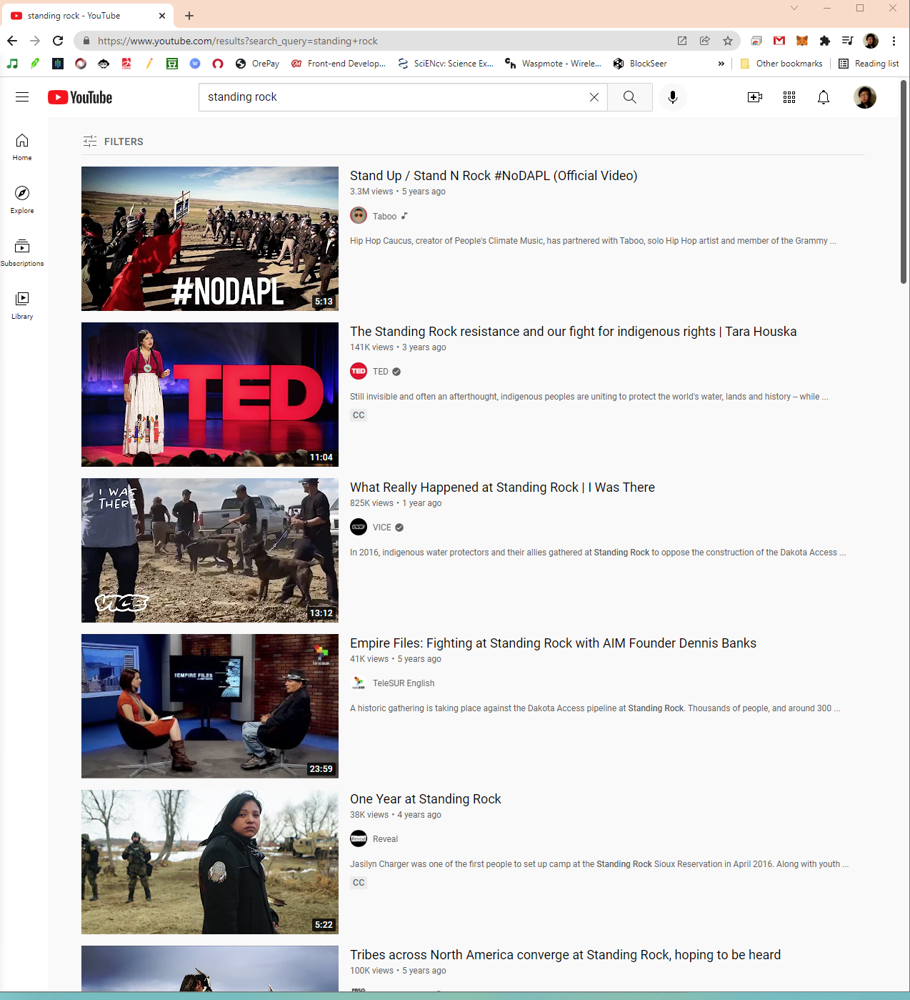
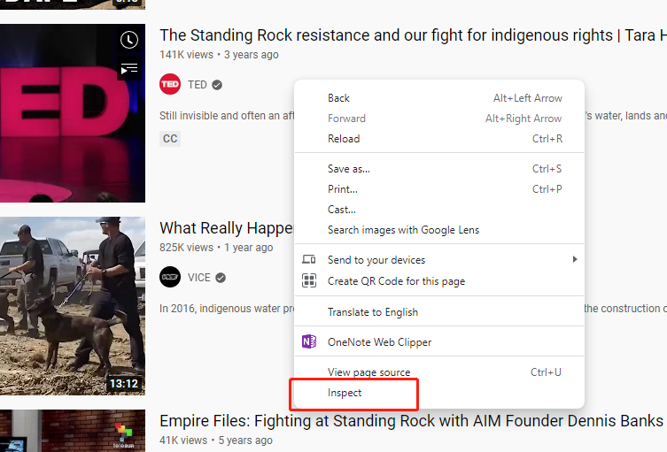
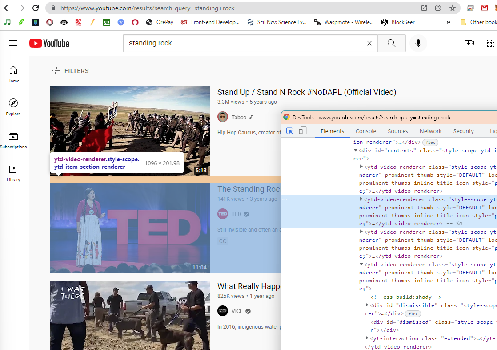
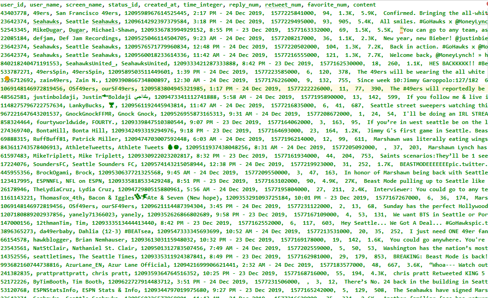
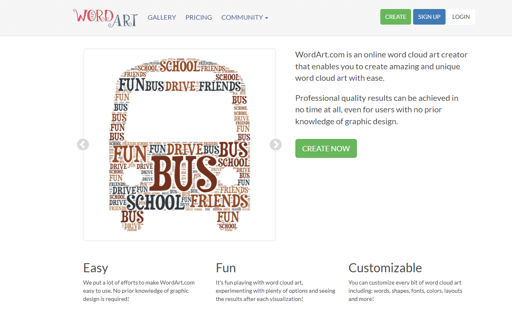
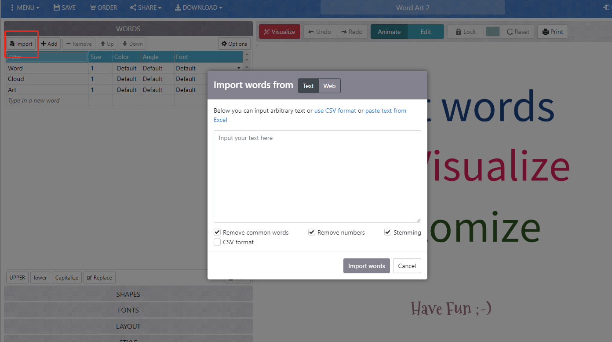
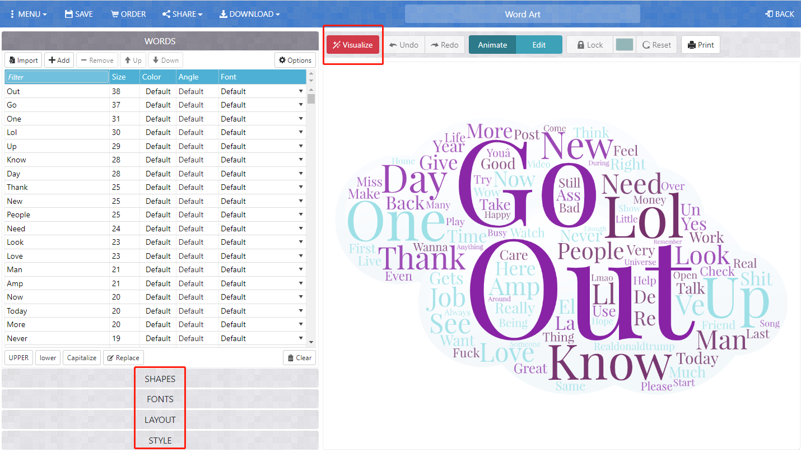

# Data collection using web crawler

**Author:** Bo Zhao, 206.685.3846 or zhaobo@uw.edu; **Points Available** = 50

In this lab, we will introduce how to collect data using a web crawler. A web crawler is a purpose-built bot for online data collection. In most cases, online data can be acquired through a dedicated API maintained by the data provider. If no API is available, you can still collect data by developing a crawler using a library such as Selenium or Scrapy. In this practical exercise, we will design a generic crawler that harvests video metadata from YouTube, and then you will develop your own crawler for a website of your choice. Let us get started.

## 1. Setup the Execution Environment on the Cloud

If you have used python for scientific research before, you already know how fiddly it is to configure an execution environment. To keep the setup light, we run the crawler on **Google Colab**. Colab lets you compose and execute arbitrary python code directly through the browser, and is especially well suited to machine learning, data analysis, and education. It ships with a hosted Jupyter notebook that requires no setup and gives free access to Google compute (including GPUs and TPUs).

## 2. Develop a generic YouTube crawler using Selenium

This section walks through the process of making a web crawler that scrapes YouTube search results. The crawler uses **Selenium** to drive a real (headless) browser so that JavaScript has time to render the video cards, and **BeautifulSoup** to extract the fields we care about.

> **Why Selenium and not `requests`?** YouTube's search page is rendered by JavaScript *after* the HTML arrives — `requests.get(url).text` returns an almost empty shell. We need a real browser to execute the scripts and reveal the video cards.

Please launch the YouTube crawler by clicking this button [](https://colab.research.google.com/github/jakobzhao/web-crawler/blob/master/youtube.ipynb). This opens [youtube.ipynb](youtube.ipynb) in Google Colab.

For any python script, metadata is usually stated at the top:

```python
# created on April 14, 2021
# last revised on April 23, 2026
# @author:          Bo Zhao
# @email:           zhaobo@uw.edu
# @website:         https://hgis.uw.edu
# @organization:    Department of Geography, University of Washington, Seattle
# @description:     A demo of collecting data from YouTube.
```

### 2.1 Install Google Chrome on the Colab VM

Selenium needs a real browser binary. We install **Google Chrome Stable** directly from Google's official `.deb`, and let **Selenium Manager** (built into Selenium ≥ 4.15) auto-download a matching `chromedriver` the first time `webdriver.Chrome()` is called. This avoids the two traps that break older tutorials:

- `apt-get install chromium` returns *"Package chromium is not available"* on Colab's Ubuntu 22.04. The distro redirects `chromium` to snap, and snap does not work inside Colab's container.
- Manually downloading `chromedriver_linux64.zip` from `chromedriver.storage.googleapis.com` pins an ancient version that will not match the Chrome you just installed — that is exactly how you get `DevToolsActivePort file doesn't exist` at startup.

```python
# 1. Install Google Chrome from Google's official .deb.
!apt-get -qq update
!wget -q https://dl.google.com/linux/direct/google-chrome-stable_current_amd64.deb
!apt-get install -y ./google-chrome-stable_current_amd64.deb
!rm -f google-chrome-stable_current_amd64.deb

# 2. Install the Python libraries. Selenium >= 4.15 ships a reliable Selenium Manager,
#    which auto-downloads a matching chromedriver the first time webdriver.Chrome() runs.
!pip install -q "selenium>=4.15" beautifulsoup4 pandas

# 3. Sanity check — should print something like "Google Chrome 147.0.x".
!google-chrome --version
```

### 2.2 Configure the task

Keep every knob you might want to change in one block at the top of the notebook. The scraping code reads from these variables, so you can rerun against a new search term without touching the logic below.

| Variable       | Meaning                                                                              |
| -------------- | ------------------------------------------------------------------------------------ |
| `QUERY`        | the search keywords                                                                  |
| `MAX_ITEMS`    | stop after collecting this many unique videos                                        |
| `MAX_SCROLLS`  | safety cap — give up after this many scrolls even if we did not reach `MAX_ITEMS`    |
| `SCROLL_PAUSE` | seconds to wait after each scroll for new cards to load                              |
| `HEADLESS`     | must stay `True` on Colab (there is no display); set `False` only if you run locally |
| `OUTPUT_PATH`  | where to save the CSV on Google Drive                                                |

```python
QUERY        = "standing rock"
MAX_ITEMS    = 100
MAX_SCROLLS  = 20
SCROLL_PAUSE = 2.0
HEADLESS     = True
OUTPUT_PATH  = "/gdrive/My Drive/videos.csv"
```



### 2.3 Helpers and the Chrome driver factory

Before the main scraping loop we define three small helpers. Factoring them out keeps the loop readable and makes each piece easy to test or swap.

**`parse_view_count("1.2K views") → 1200`**
YouTube displays counts like `"3.4M views"` or `"1,203 views"`. We convert them to integers so pandas can sort and aggregate.

**`parse_relative_time("3 years ago", anchor) → datetime`**
YouTube only shows *relative* ages like `"2 weeks ago"`. We anchor them to the scrape timestamp, so the CSV stores absolute UTC times — far more useful downstream.

**`build_driver(headless)`** centralises the Chrome options we always want on Colab:

- `binary_location="/usr/bin/google-chrome"` — point Selenium at the Chrome we installed in §2.1.
- `--headless=new` — the modern headless mode (Chrome 109+); the old `--headless` crashes on some pages.
- `--no-sandbox` — required because Colab runs as root.
- `--disable-dev-shm-usage` — **the fix for `DevToolsActivePort file doesn't exist`**. Colab's `/dev/shm` is tiny, and Chrome crashes when it tries to use it for renderer IPC.
- `--disable-gpu` — no GPU in the container; saves a warning.
- `--window-size=1280,1800` — give the page a real viewport so lazy-loaded cards render.
- `--lang=en-US` — keep the DOM in English so our selectors and `"N views"` parsing stay consistent.

See [youtube.ipynb](youtube.ipynb) **Step 3** for the full implementation.

### 2.4 Scrape the search page

The core loop lives in `scrape_youtube_search(query, ...)` in [youtube.ipynb](youtube.ipynb) **Step 4**. Five things worth understanding:

1. **Wait for the first card, not a fixed sleep.** `WebDriverWait(...).until(EC.presence_of_element_located((By.CSS_SELECTOR, "ytd-video-renderer")))` returns the moment at least one video card appears. Blind `time.sleep(5)` is either too slow or too fast.
2. **Scroll until the page stops growing.** We compare `document.documentElement.scrollHeight` before and after each scroll; when it no longer changes, YouTube has streamed all its results and we stop early. An older pattern like `for i in range(5)` never adapts to how many results actually exist.
3. **Deduplicate with a `set`.** `if video_url in seen:` on a `set` is O(1); a list-based version is silently O(n²).
4. **Catch narrow exceptions per card.** If one card has unexpected markup, log and skip — the other cards still land in the CSV. A bare `except: pass` also swallows `KeyboardInterrupt`, which makes debugging painful.
5. **Always `driver.quit()` in `finally`.** Releases the Chrome process even if the loop raises. `driver.close()` only closes one tab and leaks the session.

If YouTube changes its markup, `parse_card` is the **only** function you have to update. To find new selectors, open the live page in Chrome and use **Inspect** to explore the DOM. Right-click anywhere on the page and choose **Inspect** to open the developer tools.



In the inspector, each search result is a `ytd-video-renderer` element. Inside, you can see the anchor with `id="video-title"`, the channel link, the metadata spans for views and upload time, and the description snippet.



> **Note.** We prefer stable anchors like `a#video-title` over deep-nested auto-generated class names such as `"yt-simple-endpoint inline-block style-scope ytd-thumbnail"`. The deep class lists look precise but change every few months, which is why scrapers written against them break silently.

Running the scraper (the last cell of Step 4) returns a pandas DataFrame with:

| column                          | description                                                |
| ------------------------------- | ---------------------------------------------------------- |
| `video_url`                     | canonical `https://www.youtube.com/watch?v=...` URL        |
| `title`                         | video title                                                |
| `user_url` / `username`         | channel link and display name                              |
| `view_num` / `view_num_raw`     | parsed integer view count plus the raw string              |
| `created_at` / `created_at_raw` | absolute UTC timestamp plus the raw `"3 years ago"` string |
| `shortdesc`                     | snippet shown under the video title                        |
| `collected_at`                  | UTC timestamp of the scrape (the anchor for `created_at`)  |

### 2.5 Save the results to Google Drive

Mount your Drive once per Colab session, then write the CSV. The file lands in **My Drive** — no extra `files.download(...)` step is needed; open it from the browser, share it with the class, or load it from another notebook.

```python
from google.colab import drive
drive.mount("/gdrive")
df.to_csv(OUTPUT_PATH, index=False)
```


*Historical screenshot from the Twitter version of this lab; the new YouTube CSV has the columns listed in §2.4.*

### 2.6 When to use the YouTube Data API v3 instead

Selenium scraping is great for *learning* how dynamic pages are rendered, but for real research work the official **YouTube Data API v3** is a stronger tool:

- **Stable.** JSON from a documented endpoint, not HTML whose class names change every few months.
- **Richer.** Exact view / like / comment counts, ISO-8601 timestamps, duration, language, category, thumbnails — no string parsing, no `"3 years ago"` approximations.
- **Fast.** Up to 50 results per request, proper pagination via `nextPageToken`, no scrolling or `sleep`.
- **Compliant.** YouTube's Terms of Service generally disallow scraping; API use is permitted under the standard quota (10,000 units per day is plenty for most classroom tasks).

| Situation                                                                           | Use                                       |
| ----------------------------------------------------------------------------------- | ----------------------------------------- |
| Learning how dynamic pages, the DOM, and browser automation work                    | **Selenium (this notebook)**              |
| Quick one-off dataset for a class demo, small N                                     | Either — Selenium is faster to copy-paste |
| Research paper, reproducible study, N in the thousands                              | **Data API v3**                           |
| You need fields the rendered page does not show (exact likes, captions, categories) | **Data API v3**                           |

For this class we stay with Selenium so you can see the full page-rendering pipeline — but keep the API in mind for your own projects. A sketch of the equivalent API workflow lives in the final cell of [youtube.ipynb](youtube.ipynb).

## 3. Word cloud analysis

A word cloud visualises the high-frequency terms in a corpus and sizes them by frequency. It helps you get a quick sense of what the collected videos are about. There are several online word cloud generators; in this lab we use Word Art from https://wordart.com.

After registration, create a word cloud by pressing **Create Now** on the front page.



Open `videos.csv` (the file you saved in §2.5) in Microsoft Excel or any spreadsheet tool. Copy all the values from one of the text columns — `title` or `shortdesc` are the most informative — and paste them into the input text box on Word Art. You open the text box by pressing **Import** in the top-left. Once the text is pasted, press **Import Words**.



You will now see a list of words in the left panel. **Delete the common or meaningless terms** (stopwords, YouTube boilerplate like `"official"`, `"video"`, etc.) — otherwise the cloud will be dominated by them. Then configure the rendering by adjusting shapes, fonts, layout, and style options. When you are happy with the options, press **Visualize** at the top of the main viewport. It takes a few seconds to render.



To reuse the cloud, press **Download** on the main toolbar and choose an image format (e.g. *Standard PNG*). The word cloud is then saved on your local drive.


A word cloud helps you understand what the collected videos talked about during the period you crawled and within the specific keyword space.

## 4. Deliverable

You are expected to walk through this instruction, execute the crawler notebook, and — more importantly — develop your own crawler to collect some data from the web. Ideally, this data will be related to the research question you have stated in your statement of intent.

To submit your deliverable, create a new github repository and submit its URL to the **Canvas Dropbox** of this practical exercise. The file structure should look like this:

```powershell
[your_repository]
    │readme.md
    ├─assets
    │      videos-1.csv
    │      videos-2.csv
    │      videos-n.csv   // n depends on how many keywords or locations you explored.
    ├─img
    |      wordcloud-1.png
    |      wordcloud-2.png
    |      wordcloud-n.png
```

Grading criteria:

1. Run [youtube.ipynb](youtube.ipynb) with **at least two different keywords**, and save each run's output to the `assets/` folder of your repository. (POINT 5 each, 10 total)

2. Develop a web crawler that harvests data from a website **other than YouTube**. The script should sit at the root of your repository. For inspiration, the [backup/](backup/) folder of this repo contains legacy Twitter and geosearch examples (`tweets.ipynb`, `geosearch.py`, `01_twsearch.py`, …). Those rely on APIs and libraries that have since changed — treat them as reference, not copy-paste. (POINT 15)

3. Export two or more word clouds to the repository and embed them in `readme.md`. (POINT 10)

4. Export a sample of the results to the `assets/` folder of your repository. (POINT 5)

5. In `readme.md`, write an instruction that introduces the crawler and its usage. See [Shawn Terryah's Twitter_Geolocation repo](https://github.com/shawn-terryah/Twitter_Geolocation) for a reference structure. (POINT 10)

## Acknowledgement

I want to express my gratitude to Jou Ho who provided research assistance on developing this assignment. The notebook and README were modernized in April 2026 to work with the current Colab environment (Google Chrome Stable + Selenium Manager) and to point to the YouTube Data API v3 as an alternative. The usual disclaims apply.
