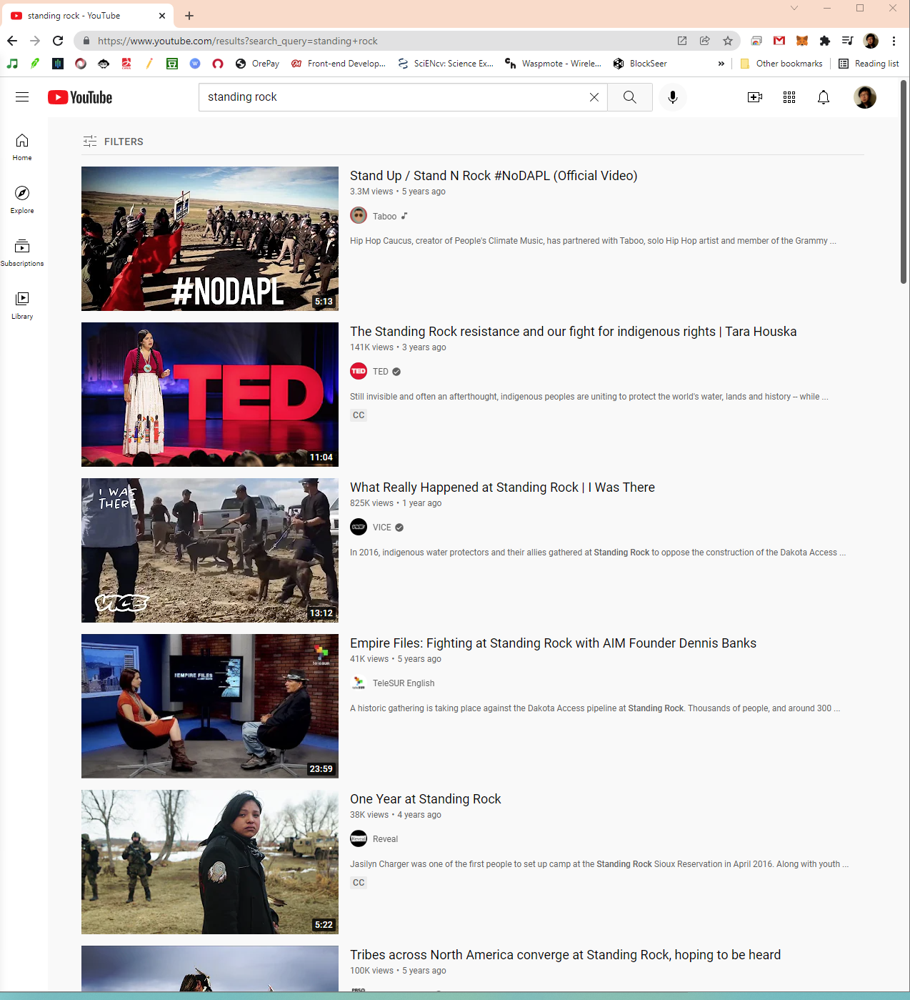
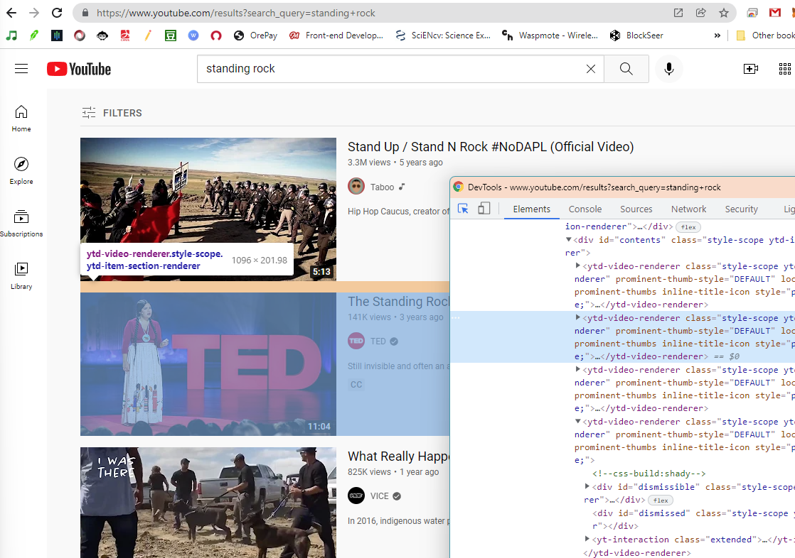
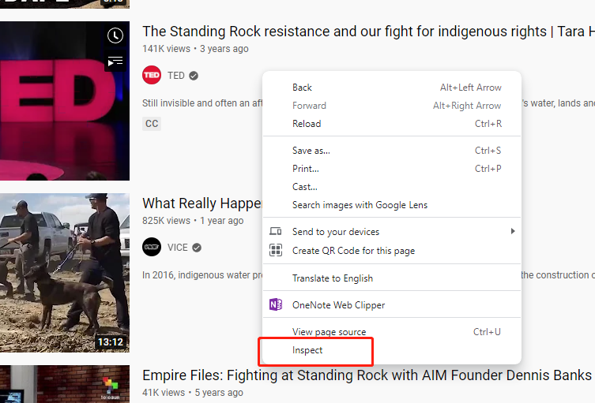
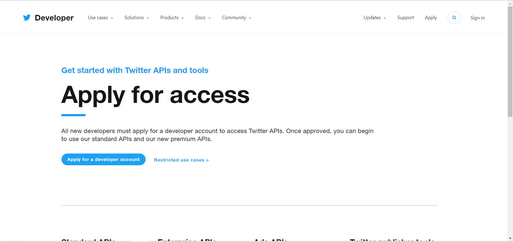
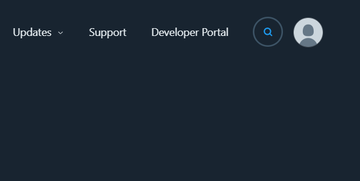
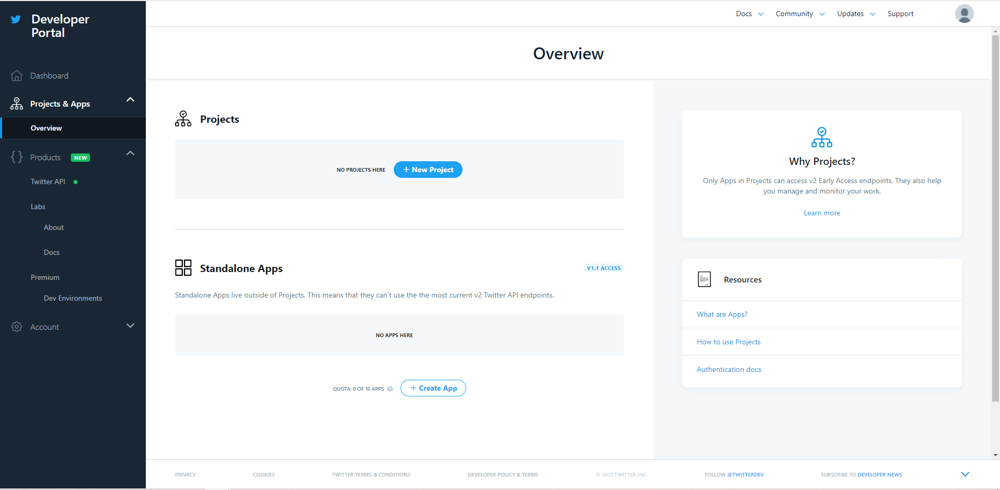
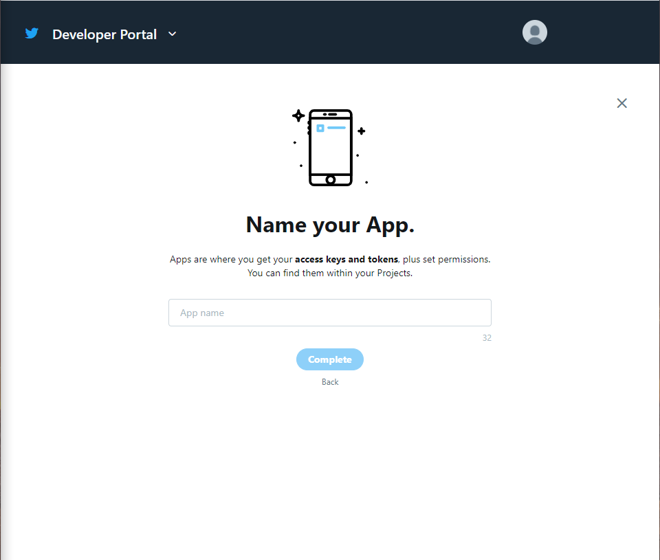
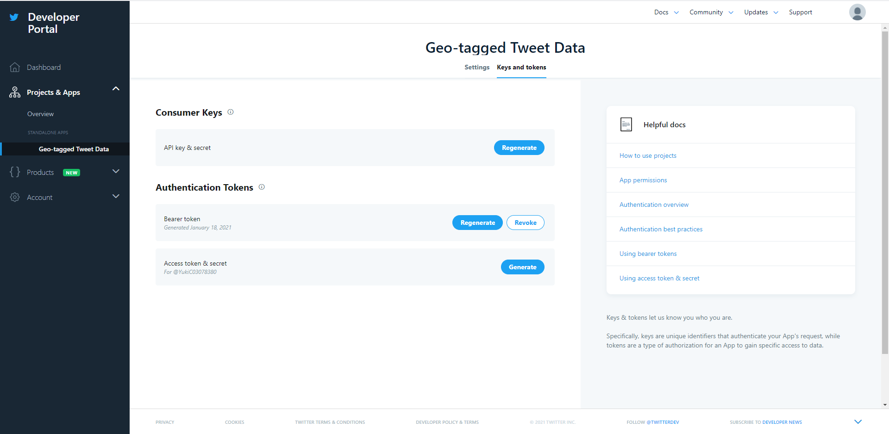

# Practical Exercise 2: Data collection using web crawler

**Instructor:** Bo Zhao, zhaobo@uw.edu; **Points Available** = 50

In this practical exercise, we will introduce how to collect Twitter data using a web crawler. A web crawler is a purposely designed bot for online data collection. In most cases, online data can be acquired through a dedicated API maintained by the data provider. If no API available, you can still collect data by developing crawler using a crawler library (e.g. Selenium, Scrapy, etc.). In this practical exercise, we will design two crawlers, one is a generic crawler to harvest data from youtube, and the other can harvest data from Twitter API. Okay, let us get started!

## 1. Setup the Execution Environment on the Cloud

If you have used python for scientific research before, you must already experience the complexity of configuring the execution environment. So, in order not to simplify the process of environment configuration, we decide to execute the crawlers on Google Colab. Google Colab allows its user to compose and execute arbitrary python code directly through the browser, and is especially well suited to machine learning, data analysis and education. There is an embedded Jupyter notebook that requires no setup and has an excellent free version, which gives free access to Google computing resources such as GPUs and TPUs.

## 2. Develop a generic Youtube crawler using Selenium

This section will walk you through the process of making a generic web crawler. This crawler manipulates a browser using a python library named "Selenium". This library enables the crawler mimic how a human user visits and/or interacts with web pages. While viewing the web pages, the crawler monitors the data flows, parses the html structure, and extracts the requested data items. Below, we will introduce how to design a crawler to collect information from a group of youtube videos.

Please launch the youtube crawler script by clicking this button [](https://colab.research.google.com/github/jakobzhao/geog595/blob/master/03_bot/youtube.ipynb). This button will enable you to open the file [03_bot/youtube.ipynb](./youtube.ipynb) on Google Colab.

For any python script, metadata are usually stated at the very beginning.

```python
# created on April 14, 2021
# modified on Jan 2, 2022
# @author:          Bo Zhao
# @email:           zhaobo@uw.edu
# @website:         https://hgis.uw.edu
# @organization:    Department of Geography, University of Washington, Seattle
# @description:     A demo of collecting data from YouTube.
```

The normal operation of Selenium requires the support of a browser in the local computer. Since we move the execution environment to the cloud, it is necessary to ensure the cloud side (Google CoLab in our case) can manipulate the browser. To do so, you plan to use Kora to control Selenium. Kora is a collection of tools to make programming on Google Colab easier. One tool of Kora is to control Selenium. The following line will enable the python program to install kora.

```Python
# Installing Kora to the remote google colab server. Kora is a collection of tools to make programming on Google Colab easier.
!pip install kora -q
```

Next, the required python libraries for this crawler will be imported. To execute the crawling task, we will use BeautifulSoup, time, datetime, pandas. Since Google Colab has already pre-installed BeautifulSoup and pandas, you do not need to install again like how you install kora.

```Python
from bs4 import BeautifulSoup
import time, datetime
import pandas as pd
# A bot can automate the collecting data process. A bot will imitate how an user browse a web page, and then acquire those useful information.
# For more information about how to operate a bot, please refer to the documentation of Selenium at https://selenium-python.readthedocs.io/
from kora.selenium import wd as bot
```

We plan to order the youtube crawler to harvest the information of videos relevant to a keyword "Standing Rock". By studying how to search youtube videos using keyword, we find out that the expected videos can be visited by the url `https://www.youtube.com/results?search_query=standing+rock`. So a variable url is created to store the url. And next, we will use the bot to visit this url.

```Python
# The url where the data will be collected from.
url = "https://www.youtube.com/results?search_query=standing+rock"
# Input the targeting url to the bot, and the bot will load data from the url.
bot.get(url)
```



Declare global variables and assign initial values.

```Python
# An array to store all the video urls. If a video has been crawled, it would not be stored to the data frame.
video_urls = []
# An array to store the retrieved video details.
results = []
```

In order to harvest the information from all the videos on the visited web page, you need to keep scrolling down the page. To stop, you can scroll a few times or detect whether you reach the bottom of the page or not. For each scroll, please ask your bot take some rest, and then resume to work.

```Python

# variable i indicates the number of times that scrolls down a web page. In practice, you might want to develop different
# interaction approach to load and view the web pages.

for i in range(5):
    ... ...
    ... ...
    ... ...
    # it is very important to enable the bot take some rest, and then resume to work.
    time.sleep(5)
    # Let the bot scrolls down to the bottom of the content element, most of the time the bot needs to scroll down to the bottom of the page.
    # like this statement: bot.execute_script("window.scrollTo(0, document.body.scrollHeight);")
    bot.execute_script('window.scrollTo(0,  document.getElementById("content").scrollHeight);')
```

In each scroll, the crawler will only parse the newly appeared videos. So, based on the testing, we find that each scroll will retrieve no more than 20 videos. To develop the locating strategy, we can use Chrome's Inspector to visually explore the elements of the opened web page and its corresponding source code.

In the inspector, you can find the HTML features of each video. For example, we find that the tag name of a video element is `ytd-video-renderer`, and each video element is also in the class of  `style-scope ytd-item-section-renderer`.



> **Note:** To open an inspector on Chrome, you can right click on the displaying web page. On the pop-up dropdown menu, click `Inspect`, and then the inspector will show up.



To locate a certain attribute of HTML element, you will need to use the syntax of beautiful soup. Beautiful Soup is also very important for destructuring html pages. Beautiful Soup is a Python library for pulling data out of HTML and XML files. It provides idiomatic ways of navigating, searching, and modifying the parse tree. If you are not familiar with Beautiful Soup, please go over the [`Quick Start` section of this documentation](https://www.crummy.com/software/BeautifulSoup/bs4/doc/#quick-start).

```Python
# Create a document object model (DOM) from the raw source of the crawled web page.
# Since you are processing a html page, 'html.parser' is chosen.
soup = BeautifulSoup(bot.page_source, 'html.parser')

# Capture all the video items using find_all or findAll method.
# To view the information of the html elements you want to collect, you need to inspect the raw source using Chrome Inspector.
videos = soup.find_all('ytd-video-renderer', class_="style-scope ytd-item-section-renderer")[-20:] # 20 indicates only process the newly-acquired 20 entries.
```

Then, you will process each video in the video list. I prefer use the "try-except" statement to enable the program run without pausing due to unexpected errors.

```python
for video in videos:

    # I prefer use the "try-except" statement to enable the program run without pausing due to unexpected errors.
    try:
        ... ...
        ... ...
    except:
        pass
```

For each video, we will extract the needed attributes, such as the video url, user url, username, title, number of views, the time when the video was created, short desc of the video, and when the video record was collected by the crawller.

```python
video_url = video.find("a", class_="yt-simple-endpoint inline-block style-scope ytd-thumbnail").attrs["href"]
user_url = video.find("a", class_="yt-simple-endpoint style-scope yt-formatted-string").attrs["href"]
username = video.find("a", class_="yt-simple-endpoint style-scope yt-formatted-string").text
title = video.find("yt-formatted-string", class_="style-scope ytd-video-renderer").text
view_num = video.find_all("span", class_="style-scope ytd-video-meta-block")[0].text.replace(" views", "")
created_at = video.find_all("span", class_="style-scope ytd-video-meta-block")[0].text.replace(" ago", "")
shortdesc = video.find("yt-formatted-string", id="description-text").text
collected_at = datetime.datetime.now()
```

Once the attributes are collected, you will create a row in the dict format. And append this newly acquired row to the results array

```python
row = {'video_url': video_url,
        'user_url': user_url,
        'username': username,
        'title': title,
        'view_num': view_num,
        'created_at': created_at,
        'shortdesc': shortdesc,
        'collected_at': collected_at}


if video_url in video_urls:
    print("this video has already been added.")
else:
    print(row)
    results.append(row)
```

To the end, you can terminate the bot when the task is completed

```python
# terminate the bot object.
bot.close()
```

Store the results as a pandas dataframe.

```python
# Store the results as a pandas dataframe
df = pd.DataFrame(results)

# notify the completion of the crawling in the console.
print("the crawling task is finished.")
```

Since the script is executed on Google Colab, we will store the data as a csv spreadsheet directly in Google Drive.

```python
# Create data on to Google Drive
from google.colab import drive
# Mount your Drive to the Colab VM.
drive.mount('/gdrive')

# the file path where to store the output csv on google drive
output_file = '/gdrive/My Drive/videos.csv'

# Save the dataframe as a csv file
df.to_csv(output_file, index=False)
```

When the csv is created successfully, you can download the csv file to your local computer.

```python
# download the csv to your local computer
from google.colab import files
files.download(output_file)
print("the csv has been downloaded to your local computer. The program has been completed successfully.")
```


## 3. Harvest geo-tagged tweets using a API-based Crawler

Please launch this Twitter crawler script by clicking this button [](https://colab.research.google.com/github/jakobzhao/geog595/blob/master/03_bot/tweets.ipynb). This button will enable you to open the file [03_bot/tweets.ipynb](./tweets.ipynb) on Google Colab.

### 3.1 prerequisite libraries and Twitter developer token

In this section, we will make a Twitter crawler to collect geotagged tweets. This crawler is based on `Tweepy` - a python based library which wraps the Twitter API. Tweepy provides a series of data crawling strategies - Harvesting geotagged tweets is just one of them. If you are interested in composing a more complicated data collection strategy, please refer to its documentation at <https://tweepy.readthedocs.io/en/latest/index.html>.

If you want to use tweepy in your local computer, you need to install tweepy using on command prompt (if a windows user) or terminal (if a Mac or Linux user), as shown in the script below.

```powershell
pip install tweepy==4.13.0
```

> note: if you work on a Jupyter Notebook such as mybinder.org, we run the following code, as shown in the script below, to install a library.

```powershell
!pip install tweepy==4.13.0
```

Although we also work on the Jupyter Notebook, we do not need to manually install tweepy because Google Colab has automatically incorporate it into its preloaded libraries.

To use the tweepy library, you need to register a Twitter developer account [here](https://developer.twitter.com/en/apply-for-access).



In order to register your account, you will be prompted to answer a series of questions. Please answer those that are required to fill in and you can ignore optional questions. Once you finish registering your account, you can apply for a Twitter app. First of all, you will need to click on `Developer Portal` which is located on the top right corner of the page.



Then, you will enter developer portal. On the left bar, you can click on `Projects &  Apps` for checking the list of apps that you've created for getting Twitter API, but for now, the list should be empty. In order to register for Twitter API, click on `+ Create App` which is under the `Standalone Apps`.



You will be prompted to fill in the app details. Here, you are required to fill in: `App name`.



After you fill in all the required fields, you may click on `Create`. Twitter takes some time to process your information to validate your access to the Twitter API. Then you will be able to see your keys and tokens.

Once you are registered, you could check your own keys and tokens again by click on your app-name which is under your app list. Go to the `App Detail` of the app you just created. Click on the tab `Keys and tokens`, and you should be able to see all the keys and tokens required to use the Twitter API.




## 3.2 Initiating the API object

As usual, we will import the needed libraries

```python
import tweepy
import pandas as pd
```

Copy and paste the bearer token you received into corresponding parameters in the code below:

```Python
bearer_token = "AAAAAAAAAAAAAAAAAAAAAGI3lQEAAAAAmam79tkOTveGwINDgIICFGj3gV4%3DSHr2kNbdyMEPnEzIxBRShNdFd862b4LKUFCjNP3Uo9WdVJ4Bt5"
client = tweepy.Client(bearer_token)
```

Initiate a tweepy API object

```python
auth = tweepy.OAuthHandler(consumer_key, consumer_secret)
auth.set_access_token(access_token, access_token_secret)
api = tweepy.API(auth, wait_on_rate_limit=True)
```

Define the search term and the date_since date as variables. We will harvest all the tweets that contains the keyword "#BLM". Also, we took out the retweet and make sure they are all written in English.

```python
search_words = "BLM  -is:retweet lang:en"
```

## 3.3 Data Harvest

Then, we input the parameters to the tweepy harvesting cursor, and we want to get back at most 1000 tweets for one single query.

```python
response = client.search_recent_tweets(
    search_words,
    max_results = 1000,
    tweet_fields = ['author_id','created_at','text','lang','geo'],
    expansions = ['geo.place_id', 'author_id'],
    place_fields = ['place_type', 'geo']
)

# In this case, the data field of the Response returned is a list of Tweet objects
tweets = response.data
```

We first create an empty array to store the retrieved data. As how we process each video in the first crawler we designed, we use the similar strategy to process each tweet, and store them in a pandas data frame.

```python
# create an array to store the result
result = []

# Iterate and print tweets
for tweet in tweets:
    row = {
        'userid': tweet.author_id,
        'lang': tweet.lang,
        'created_at': str(tweet.created_at),
        'text': tweet.text,
        'geo': tweet.geo
    }
    result.append(row)
    print(row)

# Store the results as a pandas dataframe
df = pd.DataFrame(result)

# notify the completion of the crawling in the console.
print("the crawling task is finished.")
```

In the end, we can store the tweets as a csv file to Google drive or download to the local computer.

```python
# Create data on to Google Drive
from google.colab import drive
# Mount your Drive to the Colab VM.
drive.mount('/gdrive')
  
df.to_csv(output_file, index=False)


# download the csv to your local computer
from google.colab import files
files.download(output_file)
print("the csv has been downloaded to your local computer. The program has been completed successfully.")
```

## 4. Word cloud analysis

A word cloud can visualize the high-frequency terms and map them according to their frequency. It helps to analyze the content of all the collected tweets. There are a few online word cloud generators you can use. In this lab, we use Word Art from https://wordart.com.

After registration, you can create a word cloud by pressing the "Create Now" Button on the front page.


Open `twsearch-result.csv` in microsoft excel or other alternative spreadsheet software. Copy all the rows under the `text` column, and then paste the copied rows to the input text box on Word Art. You need to press the `import` button on the top left to open this text box. Once complete, please type `Import words`.


Now you will see a list of words on the left panel, please makes sure to **delete those common terms or meaningless ones**, otherwise your word cloud will be full of meaningless terms. Then, you can configure the rendering process through adjusting the shapes, fonts, layout, and style options. After you determine all the options, please type `visualize` on top of the main viewport. It takes a few second to render the image. After that, you will see the word cloud.


In order to reuse the word cloud, you need to download an image of this word cloud by pressing the `download` button on the main toolbar and then choose the image format, like `Standard PNG`. Then, the word cloud will be saved on your local drive for reuse.


A word cloud will help you understand what twitter users have talked during the collecting time period and within the specific crawling geographical region.


## 5. Deliverable

You are expected to walk through this instruction, execute the two pieces of python scripts, and more importantly, develop your own crawler to collect some data from the web. Ideally, this data will be related to research question you have stated in your [statement of intent](../01_intro/soi.md).

To submit your deliverable, please create a new github repository, and submit the url of the GitHub to the **Canvas Dropbox** of this practical exercise. The file structure of this github repository should look like below.

```powershell
[your_repository]
    │readme.md
    ├─assets
    │      twsearch-result-1.csv
    │      twsearch-result-2.csv
    │      twsearch-result-n.csv // the number n depends on how many locations you have explored.
    ├─img
    |      wordcloud-1.png
    |      wordcloud-2.png
    |      wordcloud-n.png  // the number n depends on how many locations you have explored.
```

Here are the grading criteria:

1\. Execute both `youtube.py` and `tweets.py` with different keywords, and save the results to `videos.csv` and `tweets.csv` in the `assets` folder of the newly-created repository. (POINT 5 for each)

2\. Develop a web crawler to harvest data from a website other than Youtube. This python script should save in the root of the repository. (POINT 15)

1.  Export the two or more word clouds to the repository and then insert them to the `readme.md`.  (POINT 10)

4\. Export a sample of the results to the `assets` folder of the repository. (POINT 5)

5\. In the `readme.md` file, write an instruction to introduce the crawler and its usages. You can refer to  [https://github.com/shawn-terryah/Twitter_Geolocation](https://github.com/shawn-terryah/Twitter_Geolocation). (POINT 10)

## Acknowledgement

I want to express my gratitude to Jou Ho who provided me research assistance on developing this assignment. The usual disclaims apply.
